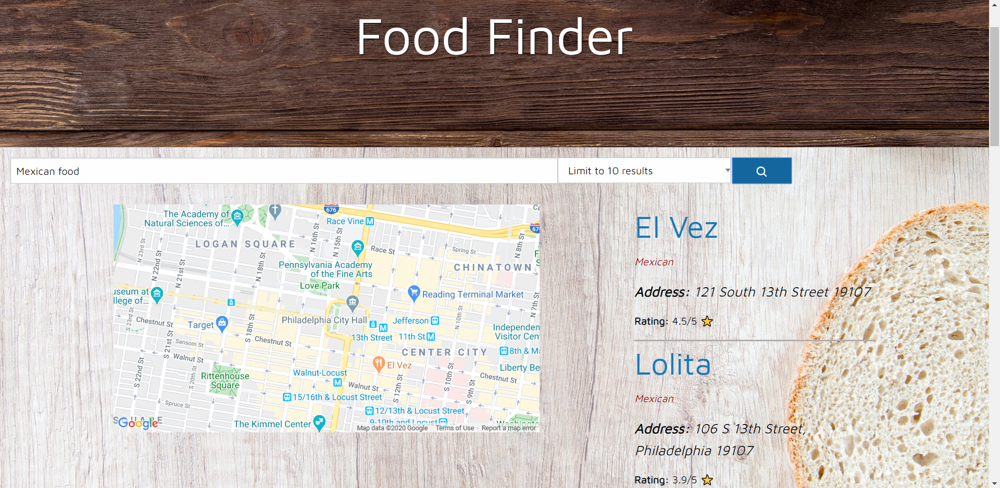
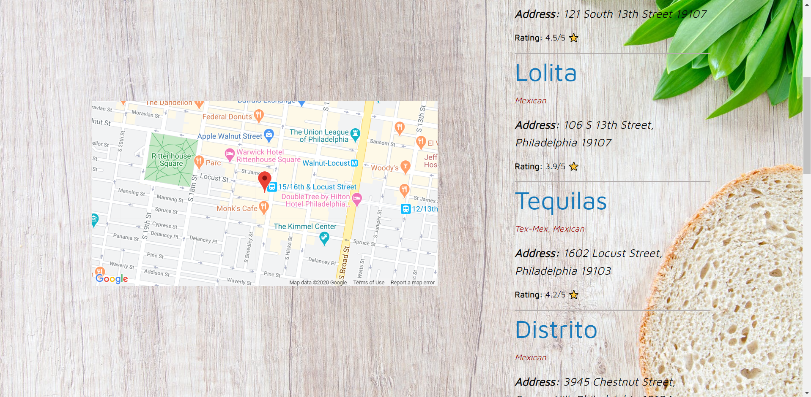

# FoodFinder

This is an application that allows the user to search for places to eat in Philadelphia. The user can specify a type of food to eat, and is presented with a list of locations in Philadelphia with that kind of food. When the user clicks on the link of one of these results, they are taken to a website with more information about the location. When the user clicks the address of a result, the location is presented on a map on the page.

This application uses the Zomato and Google Maps APIs.

[Here is a link to the application.](https://ethanl150.github.io/FoodFinder/)

## Usage

This is a 1-page application, and it is simple to use. To begin searching for locations, either specify a type of food or cuisine that you're looking for, and then click the blue search button. You can also just search without specifying anything, and still get results. If you want, you can specify the amount of results you want to be displayed. After the results are displayed, you can view information about the location, including the rating. Click the name of the location to view additional information. Click the address to see the location displayed on the map, which is fixed on the left side of the screen. Search and discover new places.

